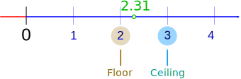

# 最大池化
作用：
- 在尽量保证需求的同时，减小数据量

# `torch.nn.MaxPool2d`
[torch.nn.MaxPool2d](https://pytorch.org/docs/stable/nn.html#pooling-layers)  
主要关注参数：
- kernel_size
- ceil_mode

ceil_mode的区别：when True, will use ceil instead of floor to compute the output shape   


# 示例代码
``` python
# -*- coding: utf-8 -*-
# 作者：小土堆
# 公众号：土堆碎念

import torch
import torchvision
from torch import nn
from torch.nn import MaxPool2d
from torch.utils.data import DataLoader
from torch.utils.tensorboard import SummaryWriter

dataset = torchvision.datasets.CIFAR10("./dataset", train=False, download=True,
                                       transform=torchvision.transforms.ToTensor())

dataloader = DataLoader(dataset, batch_size=64)

class Tudui(nn.Module):
    def __init__(self):
        super(Tudui, self).__init__()
        self.maxpool1 = MaxPool2d(kernel_size=3, ceil_mode=False)

    def forward(self, input):
        output = self.maxpool1(input)
        return output

tudui = Tudui()

writer = SummaryWriter("./logs_maxpool")
step = 0

for data in dataloader:
    imgs, targets = data
    writer.add_images("input", imgs, step)
    output = tudui(imgs)
    writer.add_images("output", output, step)
    step = step + 1

writer.close()
```
# 文档
[Polling Layers](https://pytorch.org/docs/stable/nn.html#pooling-layers)