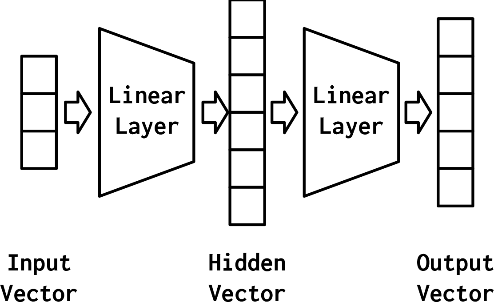

# 线性连接

# 示例
```python
# -*- coding: utf-8 -*-
# 作者：小土堆
# 公众号：土堆碎念
import torch
import torchvision
from torch import nn
from torch.nn import Linear
from torch.utils.data import DataLoader

dataset = torchvision.datasets.CIFAR10("./dataset", train=False, transform=torchvision.transforms.ToTensor(),download=True)

dataloader = DataLoader(dataset, batch_size=64)

class Tudui(nn.Module):
    def __init__(self):
        super(Tudui, self).__init__()
        self.linear1 = Linear(196608, 10)

    def forward(self, input):
        output = self.linear1(input)
        return output

tudui = Tudui()

for data in dataloader:
    imgs, targets = data
    print(imgs.shape)
    output = torch.flatten(imgs)
    print(output.shape)
    output = tudui(output)
    print(output.shape)
```
# 文档 
[Linear Layers](https://pytorch.org/docs/stable/nn.html#linear-layers)
