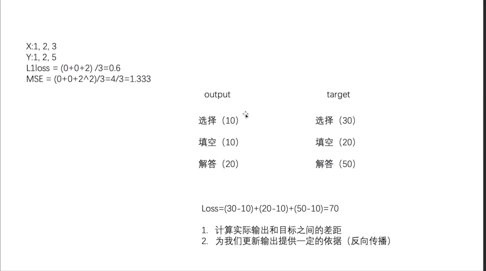
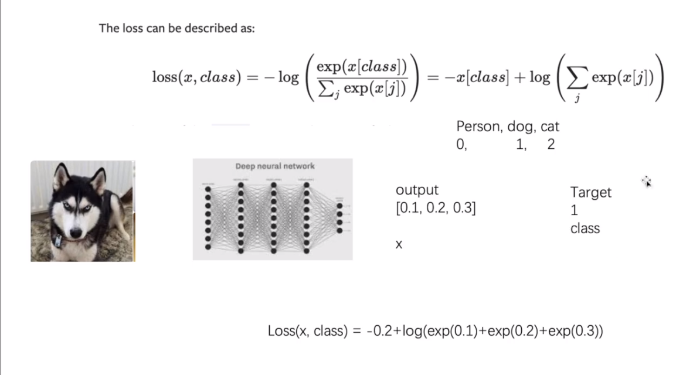

# 示例代码
1. 代码一
```python
# -*- coding: utf-8 -*-
# 作者：小土堆
# 公众号：土堆碎念
import torch
from torch.nn import L1Loss
from torch import nn

inputs = torch.tensor([1, 2, 3], dtype=torch.float32)
targets = torch.tensor([1, 2, 5], dtype=torch.float32)

inputs = torch.reshape(inputs, (1, 1, 1, 3))
targets = torch.reshape(targets, (1, 1, 1, 3))

loss = L1Loss(reduction='sum')
result = loss(inputs, targets)

loss_mse = nn.MSELoss()
result_mse = loss_mse(inputs, targets)

print(result)
print(result_mse)


x = torch.tensor([0.1, 0.2, 0.3])
y = torch.tensor([1])
x = torch.reshape(x, (1, 3))
loss_cross = nn.CrossEntropyLoss()
result_cross = loss_cross(x, y)
print(result_cross)
```
2. 代码二
```python
# -*- coding: utf-8 -*-
# 作者：小土堆
# 公众号：土堆碎念
import torchvision
from torch import nn
from torch.nn import Sequential, Conv2d, MaxPool2d, Flatten, Linear
from torch.utils.data import DataLoader

dataset = torchvision.datasets.CIFAR10("./dataset", train=False, transform=torchvision.transforms.ToTensor(),download=True)

dataloader = DataLoader(dataset, batch_size=1)

class Tudui(nn.Module):
    def __init__(self):
        super(Tudui, self).__init__()
        self.model1 = Sequential(
            Conv2d(3, 32, 5, padding=2),
            MaxPool2d(2),
            Conv2d(32, 32, 5, padding=2),
            MaxPool2d(2),
            Conv2d(32, 64, 5, padding=2),
            MaxPool2d(2),
            Flatten(),
            Linear(1024, 64),
            Linear(64, 10)
        )

    def forward(self, x):
        x = self.model1(x)
        return x


loss = nn.CrossEntropyLoss()
tudui = Tudui()
for data in dataloader:
    imgs, targets = data
    outputs = tudui(imgs)
    result_loss = loss(outputs, targets)
    result_loss.backward()
    print("ok")
```
# 文档及图片
[Loss Functions](https://pytorch.org/docs/stable/nn.html#loss-functions)  





