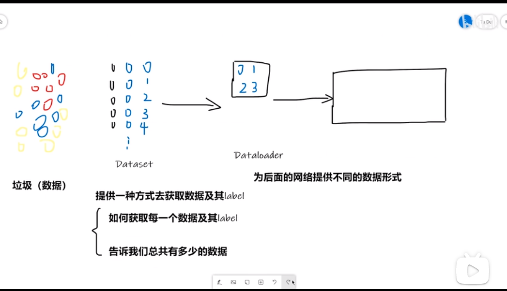

# 数据集的组织方式
```
#第一种
|---dataset #数据集目录
    |---train #训练数据集
    |    |---label1 #一个目录就是一个label
    |    |---label2
    |    |--- ···
    |---val #验证数据集

#第二种
|---dataset #数据集目录
    |---train_data #训练数据集
    |---train_label #用来存放训练数据集的label，可以用文本文件存储
    |---test_data 
    |---test_label 

#第三种
数据集的文件名就是label名
```

# Dataset的使用

1. 创建一个类，继承`Dataset`类
2. 重写`__getitem__`方法和`__len__`方法
3. 利用这个类来加载数据集

