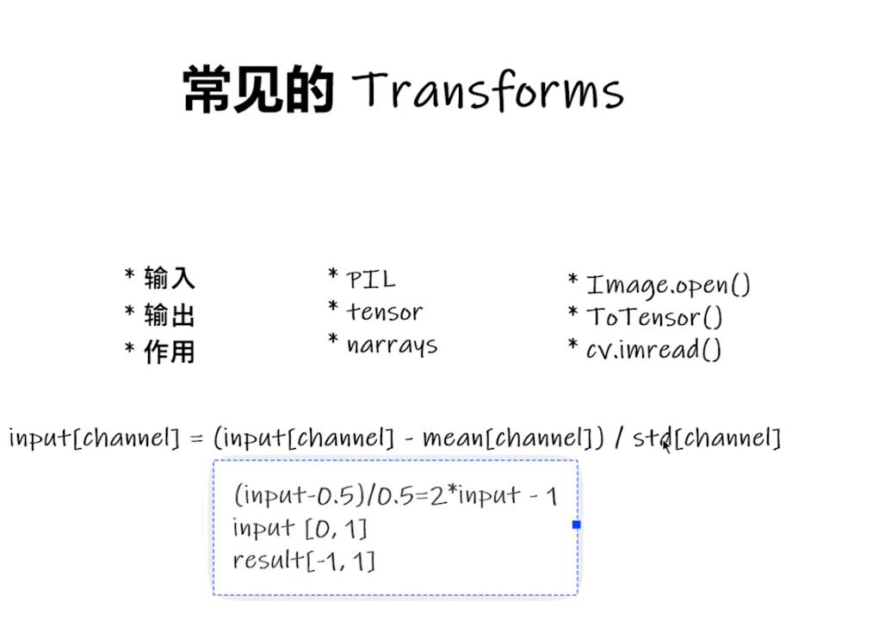

# 一、`transform`有什么用？
1. 对图片进行一些变换,比如在不同图片数据类型间变换、图片的缩放、图片的裁切等
# 二、`tensor`数据类型有什么用？
1. `tensor`数据类型包括了一些对于深度学习有用的属性,比如反向传播、梯度下降参数设置等
# 三、`transform`怎么用？
1. 首先要导入相应的模块或者包,`transform`在`torchvision.transforms`这个位置
2. 然后,我觉得就是去用`transform`提供的不同类或方法吧,具体的用法可以看官方文档,或者直接看其代码里的文档字符串

`transform`里常用的'工具':
1. Compose
2. ToTensor
3. Normalize
4. etc.

# 四、别人写的示例
1. 示例一
    ``` python
    import torchvision
    from torch.utils.tensorboard import SummaryWriter

    dataset_transform = torchvision.transforms.Compose([
        torchvision.transforms.ToTensor()
    ])

    train_set = torchvision.datasets.CIFAR10(root="./dataset", train=True, transform=dataset_transform, download=True)
    test_set = torchvision.datasets.CIFAR10(root="./dataset", train=False, transform=dataset_transform, download=True)

    # print(test_set[0])
    # print(test_set.classes)
    #
    # img, target = test_set[0]
    # print(img)
    # print(target)
    # print(test_set.classes[target])
    # img.show()
    #
    # print(test_set[0])

    writer = SummaryWriter("p10")
    for i in range(10):
        img, target = test_set[i]
        writer.add_image("test_set", img, i)

    writer.close()
    ```
2. 示例二
    ``` python
    from torch.utils.data import Dataset, DataLoader
    from PIL import Image
    import os
    from torchvision import transforms

    class MyData(Dataset):

        def __init__(self, root_dir, image_dir, label_dir, transform=None):
            self.root_dir = root_dir
            self.image_dir = image_dir
            self.label_dir = label_dir
            self.label_path = os.path.join(self.root_dir, self.label_dir)
            self.image_path = os.path.join(self.root_dir, self.image_dir)
            self.image_list = os.listdir(self.image_path)
            self.label_list = os.listdir(self.label_path)
            self.transform = transform
            # 因为label 和 Image文件名相同，进行一样的排序，可以保证取出的数据和label是一一对应的
            self.image_list.sort()
            self.label_list.sort()

        def __getitem__(self, idx):
            img_name = self.image_list[idx]
            label_name = self.label_list[idx]
            img_item_path = os.path.join(self.root_dir, self.image_dir, img_name)
            label_item_path = os.path.join(self.root_dir, self.label_dir, label_name)
            img = Image.open(img_item_path)
            with open(label_item_path, 'r') as f:
                label = f.readline()

            if self.transform:
                img = transform(img)


            return img, label

        def __len__(self):
            assert len(self.image_list) == len(self.label_list)
            return len(self.image_list)


    transform = transforms.Compose([transforms.Resize(400), transforms.ToTensor()])
    root_dir = "dataset/train"
    image_ants = "ants_image"
    label_ants = "ants_label"
    ants_dataset = MyData(root_dir, image_ants, label_ants, transform=transform)
    image_bees = "bees_image"
    label_bees = "bees_label"
    bees_dataset = MyData(root_dir, image_bees, label_bees, transform=transform)
    ```   
    