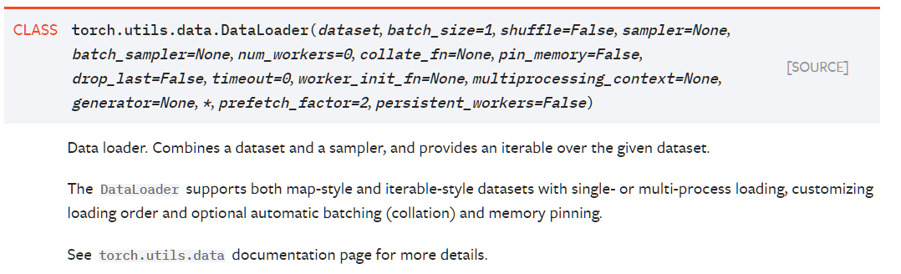
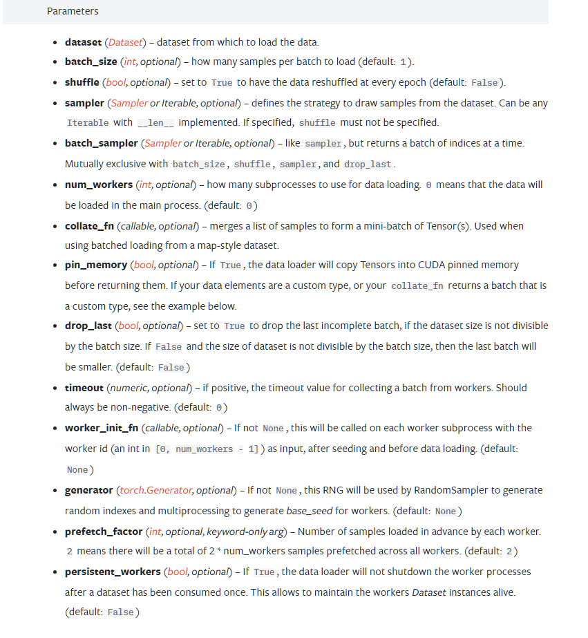
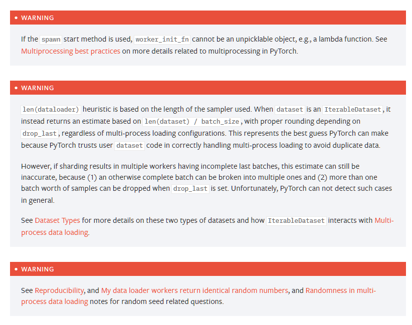

# `DataLoader`有什么用？
1. 可以将几个输入组合在一起，并以一定的方式。比如是否随机组合、是否在不能整齐组合的情况下，舍弃剩余输入等等

# `DataLoader`怎么用？
1. 首先主要要有数据集，然后将其作为DataLoader实例化的参数
2. 然后就是对可选参数的设定

# 别人的实例
``` python
import torchvision

# 准备的测试数据集
from torch.utils.data import DataLoader
from torch.utils.tensorboard import SummaryWriter

test_data = torchvision.datasets.CIFAR10("./dataset", train=False, transform=torchvision.transforms.ToTensor())

test_loader = DataLoader(dataset=test_data, batch_size=64, shuffle=True, num_workers=0, drop_last=True)

# 测试数据集中第一张图片及target
img, target = test_data[0]
print(img.shape)
print(target)

writer = SummaryWriter("dataloader")
for epoch in range(2):
    step = 0
    for data in test_loader:
        imgs, targets = data
        # print(imgs.shape)
        # print(targets)
        writer.add_images("Epoch: {}".format(epoch), imgs, step)
        step = step + 1

writer.close()
```


[DataLoader docs](https://pytorch.org/docs/stable/data.html#torch.utils.data.DataLoader)



