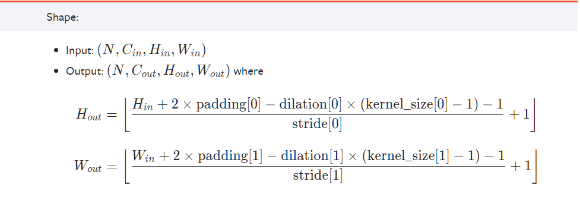

# 卷积

# `torch.nn.Conv2d`的使用
[torch.nn.Conv2d](https://pytorch.org/docs/stable/generated/torch.nn.Conv2d.html#torch.nn.Conv2d)  
主要关注参数：
- in_channels
- out_channels
- kernel_size
- stride
- padding
- dilation
其他参数默认值即可吧

参数计算公式：  


# 示例代码
``` python
# -*- coding: utf-8 -*-
# 作者：小土堆
# 公众号：土堆碎念
import torch
import torchvision
from torch import nn
from torch.nn import Conv2d
from torch.utils.data import DataLoader
from torch.utils.tensorboard import SummaryWriter

dataset = torchvision.datasets.CIFAR10("./dataset", train=False, transform=torchvision.transforms.ToTensor(),download=True)
dataloader = DataLoader(dataset, batch_size=64)

class Tudui(nn.Module):
    def __init__(self):
        super(Tudui, self).__init__()
        self.conv1 = Conv2d(in_channels=3, out_channels=6, kernel_size=3, stride=1, padding=0)

    def forward(self, x):
        x = self.conv1(x)
        return x

tudui = Tudui()

writer = SummaryWriter("./logs_conv")

step = 0
for data in dataloader:
    imgs, targets = data
    output = tudui(imgs)
    print(imgs.shape)
    print(output.shape)
    # torch.Size([64, 3, 32, 32])
    writer.add_images("input", imgs, step)
    # torch.Size([64, 6, 30, 30])  -> [xxx, 3, 30, 30]

    output = torch.reshape(output, (-1, 3, 30, 30))
    writer.add_images("output", output, step)

    step = step + 1

writer.close()
```
# 文档
[Convolution Layers](https://pytorch.org/docs/stable/nn.html#convolution-layers)  


